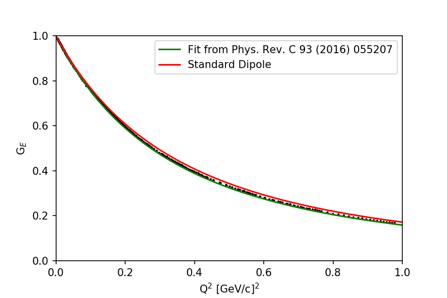
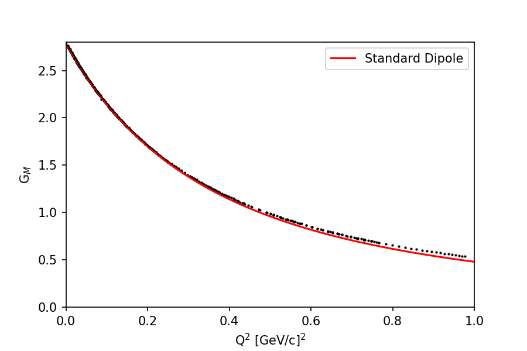

# Proton Form Factor Data

## Low Q2 High Precision Asymmetry Data

A compliation of the world's high precision, low Q2 asymmetry data.

## Cross Section Data

Next we use the asymmetry function to extract the form factors from cross section measurements.

For this we use the rebinned data of Arrington, Hill and Lee.

## References

* M. Paolone et al., PRL 105 (2010) 072001.
* X. Zhan et al., PLB 705 (2011) 59.
* C. Crawford et al., PRL 98 (2007) 052301. 
* C. Carlson et al., PRC 93 (2016) 065207.
